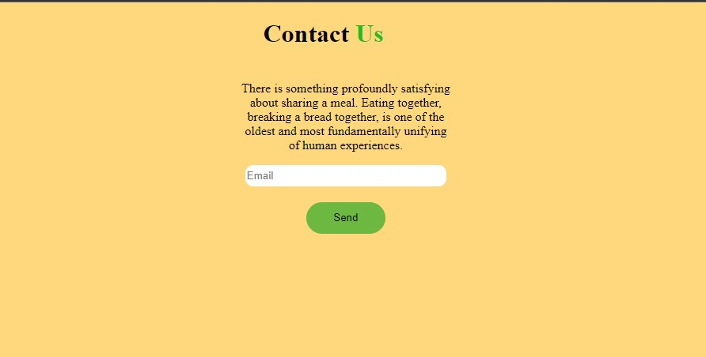
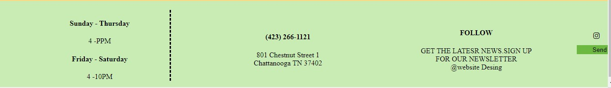

# Street Food

This project simply displays what this particular restaurant presents to its customers. It shows the images of the foods served, psyches up customers to eating out at their place and provides contacts for customers to reach them out. It also enables the customers to order food at the comfort of whatever places they are at.

## Tools 
This project will be created with the following:
1. HTML5
2. CSS3
3. Markdown

## Author
Titus Kithome Muthami

## Pre-requisites

- Linux / Windows / MacOS
 2GB Ram

## Live Link

## Screenshot

## License

